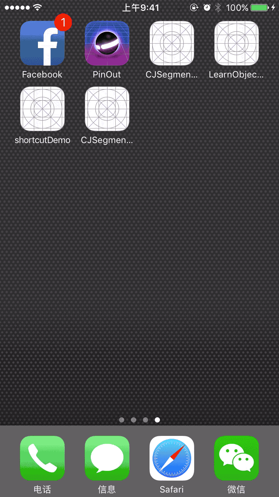

# CJSegmentController

[](https://travis-ci.org/Ji zhongyi/CJSegmentController)
[](http://cocoapods.org/pods/CJSegmentController)
[](http://cocoapods.org/pods/CJSegmentController)
[](http://cocoapods.org/pods/CJSegmentController)

## Description
As it named, CJSegmentController is a UIViewController with a segmentControl, you would meet a lot of trouble when this SegmentControl's subviews have different Bar button Item. This pod is create For this Question.

## Example

To run the example project, clone the repo, and run `pod install` from the Example directory first.


## Usage
 - import < CJViewController >
 - use ```- (instancetype)initWithViewControllers:(NSArray *)viewControllers TintColor:(UIColor *)tintColor;```
 - if you want to add bar button in navigationBar, import the Category:`UIViewController+BarButtonItem`,and manage your barButton by your subViewController like `TestVCTwo` in Demo.

## Installation

CJSegmentController is available through [CocoaPods](http://cocoapods.org). To install
it, simply add the following line to your Podfile:

```ruby
pod "CJSegmentController"
```

## Author

Ji zhongyi, jizhongyi@lngtop.com

## License

CJSegmentController is available under the MIT license. See the LICENSE file for more info.

## Demo

